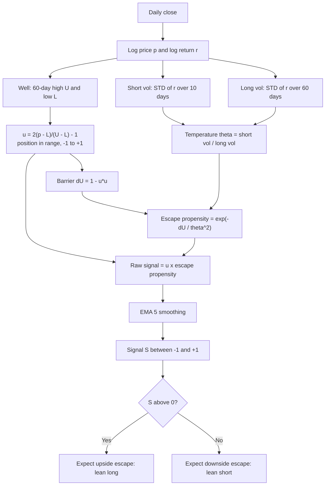

# KRM_ESC — Kramers Escape-Rate Breakout Signal

> **Origin:** statistical physics (Kramers / Arrhenius escape from a potential well)
> **Working expression:** `EMA(MUL(DPOS(m=60), EXP(NEG(DIV(SUB(1, SQ(DPOS(m=60))), SQ(DIV(STD(R1, n=10), STD(R1, n=60))))))), n=5)`
> **Status:**  **Designed only. Not backtested.** No performance numbers exist yet.

## 1. The idea in plain English

Picture a **ball rolling in a bowl**. The bowl is the recent trading range: the floor is the 60-day low, the ceiling is the 60-day high.

- If the ball sits in the **middle** of the bowl, it needs a lot of energy to climb out.
- If the ball sits **near the rim**, only a small push is needed.
- The **temperature** is how violently the ball is being shaken, which is today's short-term volatility compared with normal volatility.

Chemists and physicists have a formula for how likely the ball is to escape: the **Arrhenius / Kramers escape rate**, which grows exponentially as the barrier shrinks or the temperature rises. This strategy turns that into a signal:

> **Signal = (which side of the bowl the price is on) × (how likely it is to escape over that rim right now).**

Near the top of the range in a hot market gives a strong **positive** signal (expect an upside breakout). Near the bottom in a hot market gives a strong **negative** signal. In the middle of the range, or in a calm market, the signal stays near zero.

## 2. Physics to market dictionary

| Physics concept | Market meaning | Symbol |
|---|---|---|
| Particle position | Log price | $p_t$ |
| Potential well | Recent trading range | $[L_t, U_t]$ |
| Position in the well | Where price sits inside the range, from -1 to +1 | $u_t$ |
| Barrier height to escape | Remaining "climb" to the nearest range edge | $\Delta U_t$ |
| Temperature / noise strength | Short-term vol relative to long-term vol | $\theta_t$ |
| Escape rate (Arrhenius factor) | Breakout propensity | $\Lambda_t$ |

## 3. Formula

Notation: $C_t$ = close on day $t$. All quantities use data up to day $t$ only.

**Step 1 – Log price and log return**

$$
p_t=\ln C_t,\qquad r_t=p_t-p_{t-1}
$$

**Step 2 – The well: position inside the range** ($m=60$)

$$
U_t=\max_{0\le i<m}p_{t-i},\qquad L_t=\min_{0\le i<m}p_{t-i},\qquad
u_t=\frac{2\,(p_t-L_t)}{U_t-L_t}-1\ \in[-1,\,1]
$$

If $U_t=L_t$ set $u_t=0$.  $u_t=+1$ means at the ceiling, $u_t=-1$ at the floor, $u_t=0$ at the centre.

**Step 3 – Harmonic potential and remaining barrier**

Model the range as a parabolic well $V(u)=\kappa u^2/2$ with walls at $u=\pm1$. The energy the particle still needs to reach a wall is

$$
\Delta U_t=\tfrac{\kappa}{2}\left(1-u_t^{2}\right)
$$

We fix $\kappa=2$, so $\Delta U_t=1-u_t^{2}\in[0,1]$. It is largest in the centre and zero at the walls.

**Step 4 – Temperature** ($n_s=10,\ n_\ell=60$)

$$
\sigma^{S}_t=\operatorname{STD}_{n_s}(r)_t,\qquad
\sigma^{L}_t=\operatorname{STD}_{n_\ell}(r)_t,\qquad
\theta_t=\frac{\sigma^{S}_t}{\sigma^{L}_t}
$$

$\theta_t>1$ means the market is hotter than normal, $\theta_t<1$ colder. The noise strength (diffusion constant) is $D_t=D_0\,\theta_t^{2}$ with $D_0=1$.

**Step 5 – Arrhenius / Kramers escape propensity**

Kramers' rate is $r_K\propto \exp(-\Delta U/D)$. Keeping the exponential factor:

$$
\Lambda_t=\exp\!\left(-\frac{\Delta U_t}{D_t}\right)=\exp\!\left(-\frac{1-u_t^{2}}{\theta_t^{2}+\varepsilon}\right)\ \in(0,\,1],\qquad \varepsilon=10^{-4}
$$

**Step 6 – Directed raw signal**

$$
S^{\text{raw}}_t=u_t\cdot\Lambda_t
$$

The sign says *which wall* (up or down), and the magnitude says *how likely the escape is*.

**Step 7 – Smoothing** ($n=5$, $\alpha=\tfrac13$)

$$
S_t=\operatorname{EMA}_5\!\big(S^{\text{raw}}\big)_t,\qquad \operatorname{EMA}_t=\alpha\,x_t+(1-\alpha)\operatorname{EMA}_{t-1}
$$

**All together**

$$
\boxed{\,S_t=\operatorname{EMA}_5\!\left[\;u_t\cdot\exp\!\left(-\frac{1-u_t^{2}}{\left(\sigma^{S}_t/\sigma^{L}_t\right)^{2}+\varepsilon}\right)\right]\,}
$$

## 4. Sanity checks (limiting behaviour)

| Situation | $u_t$ | $\theta_t$ | $\Lambda_t$ | Signal |
|---|---|---|---|---|
| Mid-range, calm market | 0 | small | about 0 | about 0 (no action) |
| Mid-range, hot market | 0 | large | up to $e^{-1}\approx0.37$ | 0, because $u=0$ kills direction |
| Near ceiling, hot market | about +1 | large | about 1 | strong positive |
| Near floor, hot market | about -1 | large | about 1 | strong negative |
| Near ceiling, calm market | about +1 | small | about 1, since $1-u^2\approx0$ | positive, but $u$ near 1 keeps it high |
| Hot limit $\theta\to\infty$ | any | $\infty$ | $\to1$ | reduces to plain range position $u_t$ |
| Frozen limit $\theta\to0$ | $\lvert u\rvert<1$ | 0 | $\to0$ | 0 |

The signal is bounded in $[-1,1]$, which makes position sizing straightforward.

## 5. Direction hypothesis and variant

The default assumes **breakout** behaviour (price near an edge tends to push through). Markets can also **mean-revert** from range edges. Which sign works is an empirical question, so the mirrored variant is defined too:

$$
S^{-}_t=-S_t
$$

## 6. Algorithm diagram

## 7. Parameters

| Parameter | Default | Meaning | Suggested search range |
|---|---|---|---|
| $m$ | 60 | Range (well) window | 20 to 250 |
| $n_s$ | 10 | Short-vol window (temperature numerator) | 5 to 20 |
| $n_\ell$ | 60 | Long-vol window (temperature denominator) | 40 to 250 |
| $\kappa$ | 2 | Well stiffness, absorbed into $\Delta U$ | fixed |
| $n$ (EMA) | 5 | Output smoothing | 1 to 20 |
| $\varepsilon$ | $10^{-4}$ | Division guard | fixed |

Only four parameters are free, which keeps the search space small and limits overfitting.

## 8. Test results

**Not run, by design.** The table below is intentionally empty.

| | Sharpe | Sortino | Max DD | Turnover | Mean pos | Bull | Bear |
|---|---|---|---|---|---|---|---|
| In-sample | n/a | n/a | n/a | n/a | n/a | n/a | n/a |
| Out-of-sample | n/a | n/a | n/a | n/a | n/a | n/a | n/a |

### Suggested validation plan (same suite as `KELT_HMA_RANK_133`)

1. Train/OOS split with the sign fixed **before** looking at OOS results (breakout or mean-reversion).
2. Cost sensitivity at 0 to 20 bps.
3. Block-bootstrap Monte Carlo (300+ sims).
4. Parameter probes on $m,\ n_s,\ n_\ell,\ n$; the verdict should not be FRAGILE.
5. 5-fold time-slice stability.
6. Bull/bear regime split (SPY above/below SMA200).

### What would count as failure

- OOS Sharpe near 0 or negative for both signs.
- Performance that collapses when $m$ or $n_\ell$ moves by 20 percent.
- Benefit disappearing when $\Lambda_t$ is replaced by a constant 1 (which would mean the physics gate adds nothing beyond plain range position $u_t$). Run this ablation.

## 9. Notes and caveats

- The Kramers rate has a prefactor $\omega_a\omega_b/(2\pi\gamma)$ that is dropped here; only the exponential (Arrhenius) factor is used, which is what matters most.
- Range position and volatility ratios are standard building blocks. The novelty is the **Arrhenius-style gating** that combines them. I have not searched the literature, so I can't rule out similar prior use.
- The expression uses new primitives (`DPOS` for range position, `SQ`, `EXP`, `NEG`, `STD` on returns `R1`) that may not exist in your operator set, and its node count is higher than the frontier strategies. Complexity penalties in your search would count against it.
- The physical analogy motivates the form, but it is not evidence that markets obey it.