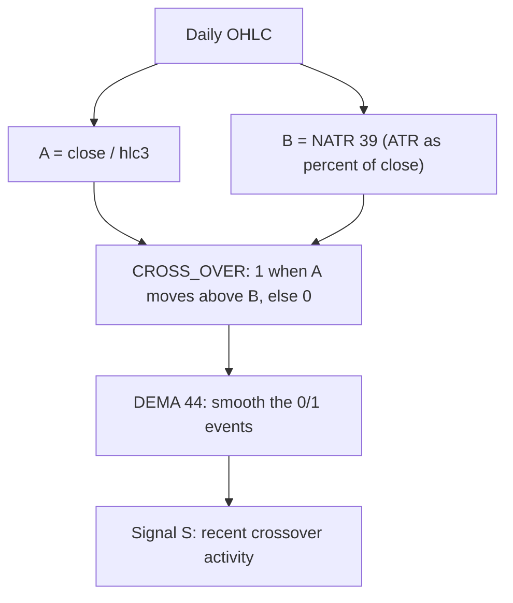

# DEMA_XOVER_NATR — Smoothed Crossover Events

> **Expression:** `DEMA(CROSS_OVER(DIV(close, hlc3), NATR(n=39)), n=44)`
> **Complexity:** 6 · **Out-of-sample Sharpe:** **+0.232**

## 1. The idea in plain English

1. Compute the ratio **close ÷ typical price** (is the close above or below the day's average of high, low, close?).
2. Compute **NATR(39)**: volatility as a percentage of price.
3. Flag a **1** on days when the ratio *crosses above* the volatility line, otherwise **0**.
4. Smooth those 0/1 flags with a **Double EMA (44)** so the signal becomes a slowly varying "how often have crossovers happened recently" score.

## 2. Formula

**Step 1 – ratio**

$$
A_t=\frac{C_t}{\operatorname{hlc3}_t},\qquad \operatorname{hlc3}_t=\frac{H_t+L_t+C_t}{3}
$$

**Step 2 – normalised ATR** ($n=39$)

$$
B_t=\operatorname{NATR}_{39}(t)=100\cdot\frac{\operatorname{ATR}_{39}(t)}{C_t}
$$

**Step 3 – crossover indicator**

$$
X_t=\mathbf 1\!\left[A_t>B_t\ \text{ and }\ A_{t-1}\le B_{t-1}\right]\in\{0,1\}
$$

**Step 4 – Double EMA** ($n=44$, $\alpha=\tfrac{2}{45}$)

$$
S_t=\operatorname{DEMA}_{44}(X)_t=2\,\operatorname{EMA}_{44}(X)_t-\operatorname{EMA}_{44}\!\big(\operatorname{EMA}_{44}(X)\big)_t
$$

## 3. Algorithm diagram

## 4. Test results

| | Out-of-sample Sharpe | Complexity |
|---|---|---|
| **Out-of-sample** | **+0.232** | 6 |

Only the OOS Sharpe was in the log for this strategy.

**Read:** the most complex and weakest of the set. Because $A_t$ hovers near 1 while $B_t$ is a slowly moving volatility level, crossovers are rare events, so the signal is sparse and the result likely rests on few observations. Low confidence.

## 5. Assumptions

CROSS_OVER as an upward cross (1/0); NATR expressed in percent (if expressed as a fraction the structure is identical, only the scale of $B_t$ changes); DIV is plain division; ATR uses Wilder smoothing.
