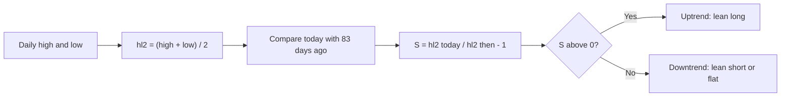

# HL2_ROC — Mid-Price Momentum (83 days)

> **Expression:** `ROC(hl2, n=83)`
> **Complexity:** 2 · **Out-of-sample Sharpe:** **+0.332**

## 1. The idea in plain English

Take each day's **midpoint of the high and low**, and compare it with the midpoint **83 trading days ago** (about 4 months). Rising midpoint means uptrend; falling means downtrend. Using the midpoint reduces the noise of any single closing print.

## 2. Formula

$$
\operatorname{hl2}_t=\frac{H_t+L_t}{2}
$$

$$
S_t=\operatorname{ROC}_{83}(\operatorname{hl2})_t=\frac{\operatorname{hl2}_t}{\operatorname{hl2}_{t-83}}-1
$$

## 3. Algorithm diagram

## 4. Test results

| | Out-of-sample Sharpe | Complexity |
|---|---|---|
| **Out-of-sample** | **+0.332** | 2 |

Only the OOS Sharpe was in the log.

**Read:** a simple momentum baseline, similar in spirit to [`OPEN_ROC`](OPEN_ROC.md) but with a shorter lookback and a smoother price input; modest edge.

## 5. Assumptions

ROC as fractional change; position mapping and costs handled by the engine.
