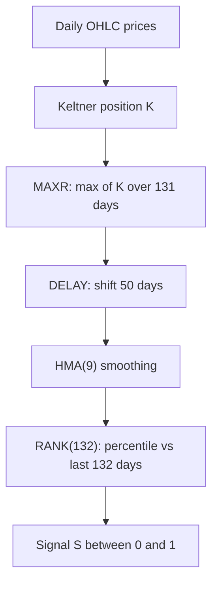

# KELT_HMA_RANK_132 — Twin of KELT_HMA_RANK_133 (rank window 132)

> **Expression:** `RANK(HMA(DELAY(MAXR(KELTNER(n=30, k=1.9789691043998496), n=131), n=50), n=9), n=132)`
> **Complexity:** 5 · **Out-of-sample Sharpe:** **+1.060**

This is the same strategy as [`KELT_HMA_RANK_133`](KELT_HMA_RANK_133.md) with the final ranking window shortened from 133 to 132 days. Results are almost identical, which is a small sign that the final rank window is not what drives performance.

## 1. The idea in plain English

1. Measure how stretched price is versus its volatility band (Keltner).
2. Keep the highest stretch of the last 131 days.
3. Look at it as of 50 days ago.
4. Smooth it (Hull MA).
5. Convert to a percentile versus the last **132** days.

## 2. Formula

$$
K_t=\frac{C_t-\operatorname{EMA}_{30}(C)_t}{k\cdot \operatorname{ATR}_{30}(t)},\qquad k=1.97897
$$

$$
M_t=\max_{0\le i<131}K_{t-i},\qquad D_t=M_{t-50}
$$

$$
S_t=\frac{1}{132}\sum_{i=0}^{131}\mathbf 1\!\left[\operatorname{HMA}_9(D)_{t-i}\le \operatorname{HMA}_9(D)_t\right],\qquad
\operatorname{HMA}_9(D)=\operatorname{WMA}_3\!\big(2\operatorname{WMA}_4(D)-\operatorname{WMA}_9(D)\big)
$$

Building-block definitions (EMA, ATR, WMA) are the same as in [`KELT_HMA_RANK_133`](KELT_HMA_RANK_133.md).

## 3. Algorithm diagram

## 4. Test results

Only the Pareto-frontier row was included in the log for this variant (the deep validation suite was run on the 133 version).

| | Sharpe | Sortino | Max DD | Turnover | Mean pos | Bull | Bear |
|---|---|---|---|---|---|---|---|
| In-sample | +1.278 | +1.865 | 0.068 | 0.0261 | +0.076 | +1.20 | +2.15 |
| **Out-of-sample** | **+1.060** | n/a | n/a | n/a | n/a | n/a | n/a |

For robustness evidence (cost, bootstrap, folds, regimes) see the results in [`KELT_HMA_RANK_133`](KELT_HMA_RANK_133.md); the same fragility caveat applies.

## 5. Assumptions

Same as in `KELT_HMA_RANK_133`: standard indicator definitions, Keltner as band-position, position mapping handled by the engine.
