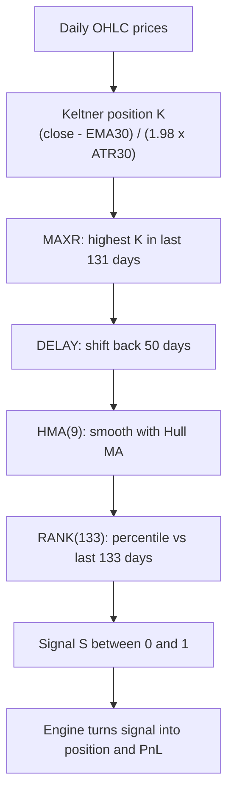

# KELT_HMA_RANK_133 — Keltner → Rolling Max → Delay → Hull MA → Rank

> **Expression:** `RANK(HMA(DELAY(MAXR(KELTNER(n=30, k=1.9789691043998496), n=131), n=50), n=9), n=133)`
> **Complexity:** 5 · **Out-of-sample Sharpe:** **+1.060** (best strategy found)

## 1. The idea in plain English

1. Measure **how stretched the price is** relative to its normal volatility band (a Keltner channel).
2. Remember the **highest stretch seen in the last 131 days**.
3. Look at that memory **as it was 50 days ago** (a deliberate lag).
4. **Smooth** it with a Hull Moving Average so it is not jumpy.
5. Convert the result into a **percentile (0 to 1)** versus the last 133 days. High percentile = strong signal.

## 2. Formula

Notation: $C_t$ = close, $H_t$ = high, $L_t$ = low on day $t$.

**Step 1 – Keltner position** ($n=30,\ k=1.97897$)

$$
K_t=\frac{C_t-\operatorname{EMA}_{30}(C)_t}{k\cdot \operatorname{ATR}_{30}(t)}
$$

**Step 2 – Rolling maximum (MAXR)**

$$
M_t=\max_{0\le i<131}K_{t-i}
$$

**Step 3 – Delay**

$$
D_t=M_{t-50}
$$

**Step 4 – Hull Moving Average** ($n=9$)

$$
\operatorname{HMA}_9(D)_t=\operatorname{WMA}_{3}\Big(2\,\operatorname{WMA}_{4}(D)-\operatorname{WMA}_{9}(D)\Big)_t
$$

**Step 5 – Rolling percentile rank** ($n=133$)

$$
S_t=\operatorname{RANK}_{133}(\operatorname{HMA}_9(D))_t=\frac{1}{133}\sum_{i=0}^{132}\mathbf 1\!\left[\operatorname{HMA}_9(D)_{t-i}\le \operatorname{HMA}_9(D)_t\right]
$$

**All together**

$$
S_t=\operatorname{RANK}_{133}\!\Big(\operatorname{HMA}_9\big(\,\max_{0\le i<131}K_{t-50-i}\,\big)\Big)
$$

## 3. Building blocks

| Block | Definition |
|---|---|
| $\operatorname{EMA}_n$ | $\text{EMA}_t=\alpha x_t+(1-\alpha)\text{EMA}_{t-1}$, with $\alpha=\tfrac{2}{n+1}$ |
| True range | $TR_t=\max\big(H_t-L_t,\ \lvert H_t-C_{t-1}\rvert,\ \lvert L_t-C_{t-1}\rvert\big)$ |
| $\operatorname{ATR}_n$ | Wilder average: $\text{ATR}_t=\frac{(n-1)\text{ATR}_{t-1}+TR_t}{n}$ |
| $\operatorname{WMA}_n$ | $\displaystyle\frac{\sum_{i=0}^{n-1}(n-i)\,x_{t-i}}{n(n+1)/2}$ |

## 4. Algorithm diagram

## 5. Test results

### 5.1 Headline numbers

| | Sharpe | Sortino | Max DD | Mean pos | Bull Sharpe | Bear Sharpe |
|---|---|---|---|---|---|---|
| In-sample | +1.279 | +1.870 | 0.068 | +0.076 | +1.196 | +2.164 |
| **Out-of-sample** | **+1.060** | +1.311 | 0.084 | +0.096 | +1.859 | +0.273 |

Train turnover: 0.0260 (OOS: 0.0210).

### 5.2 Transaction-cost sensitivity (OOS)

| Cost (bps) | Sharpe | Sortino | Max DD | Turnover | Return % |
|---|---|---|---|---|---|
| 0.0 | +1.069 | +1.322 | 0.084 | 0.0210 | +26.4 |
| 0.5 | +1.065 | +1.317 | 0.084 | 0.0210 | +26.2 |
| 1.0 | +1.060 | +1.311 | 0.084 | 0.0210 | +26.1 |
| 2.0 | +1.052 | +1.300 | 0.084 | 0.0210 | +25.9 |
| 5.0 | +1.025 | +1.267 | 0.084 | 0.0210 | +25.1 |
| 10.0 | +0.981 | +1.212 | 0.084 | 0.0210 | +23.9 |
| 20.0 | +0.893 | +1.102 | 0.084 | 0.0210 | +21.4 |

**Sharpe retained at 10 bps: 91.8 %.** Very low turnover makes it cost-robust.

### 5.3 Monte Carlo block bootstrap (OOS, 300 simulations)

| Metric | Mean | Std | 5th pct | Median | 95th pct |
|---|---|---|---|---|---|
| Sharpe | +1.069 | 0.500 | +0.217 | +1.074 | +1.828 |
| Sortino | +1.366 | 0.690 | +0.232 | +1.339 | +2.500 |
| Max drawdown | 0.073 | 0.025 | 0.041 | 0.069 | 0.119 |

### 5.4 Parameter sensitivity (OOS)

| Baseline Sharpe | Probe mean | Probe std | Probe range | Probes | Verdict |
|---|---|---|---|---|---|
| +1.060 | +0.875 | 0.305 | [-0.286, +1.107] | 36 | **FRAGILE** |

### 5.5 Time-slice stability (5 sequential folds, full history)

| Fold | Sharpe | Sortino | Max DD | Observations |
|---|---|---|---|---|
| 1 | +0.604 | +0.711 | 0.068 | 634 |
| 2 | +1.533 | +2.046 | 0.037 | 634 |
| 3 | +0.890 | +0.996 | 0.041 | 634 |
| 4 | +0.184 | +0.212 | 0.095 | 634 |
| 5 | +0.686 | +0.763 | 0.043 | 638 |

Mean +0.779, std 0.441, **5 of 5 folds positive**.

### 5.6 Regime split (OOS, bull = SPY above its 200-day SMA)

| Regime | Sharpe | Sortino | Max DD | Observations |
|---|---|---|---|---|
| Bull | +1.859 | +2.958 | 0.048 | 533 |
| Bear | +0.273 | +0.366 | 0.060 | 220 |

## 6. How to read this honestly

- **Good:** high Sharpe, tiny turnover, survives costs, positive in all 5 time folds.
- **Caution:** the parameter probe verdict is **FRAGILE** (some nearby settings go negative), the bootstrap 5th-percentile Sharpe is only +0.22, and the edge is mostly a **bull-market** effect.

## 7. Assumptions

The log does not show the library source, so these are the standard definitions: Keltner output as band-position (if the engine returns the upper band instead, use $\operatorname{EMA}_{30}(C)+k\cdot\operatorname{ATR}_{30}$ in Step 1); MAXR = rolling max; RANK = time-series percentile. The signal-to-position mapping, Sharpe annualisation and cost model are handled by the backtest engine.
