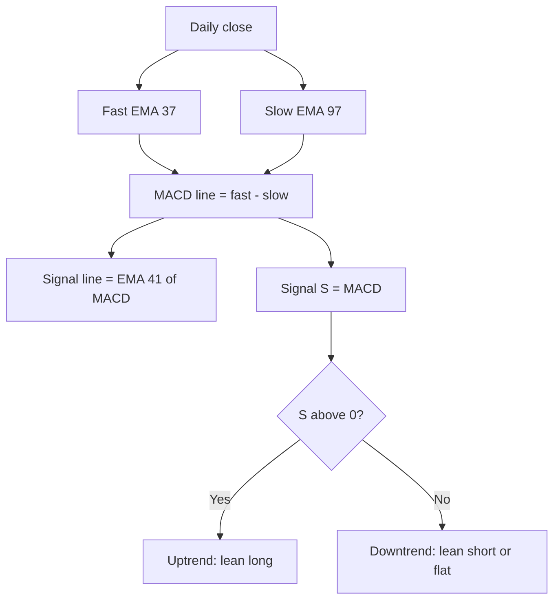

# MACD_37_97_41 — Slow-Parameter MACD

> **Expression:** `MACD(fast=37, slow=97, signal=41)`
> **Complexity:** 1 · **Out-of-sample Sharpe:** **+0.731** (second best, and the simplest)

## 1. The idea in plain English

MACD compares a **fast** moving average (37 days) to a **slow** one (97 days). When the fast average is above the slow one, the trend is up. Standard MACD uses 12/26/9 days; this version is tuned to much slower settings, so it trades rarely and follows big trends.

## 2. Formula

$$
\operatorname{MACD}_t=\operatorname{EMA}_{37}(C)_t-\operatorname{EMA}_{97}(C)_t
$$

$$
\operatorname{Signal}_t=\operatorname{EMA}_{41}(\operatorname{MACD})_t,\qquad
\operatorname{Hist}_t=\operatorname{MACD}_t-\operatorname{Signal}_t
$$

with $\operatorname{EMA}_n$: $\text{EMA}_t=\alpha C_t+(1-\alpha)\text{EMA}_{t-1}$, $\alpha=\tfrac{2}{n+1}$.

The strategy signal is $S_t=\operatorname{MACD}_t$ (the MACD line). If the engine returns the histogram instead, use $S_t=\operatorname{Hist}_t$.

## 3. Algorithm diagram

## 4. Test results

| | Out-of-sample Sharpe | Complexity |
|---|---|---|
| **Out-of-sample** | **+0.731** | 1 |

Only the OOS Sharpe was in the log.

**Read:** complexity 1 with a healthy Sharpe is attractive. Fewer moving parts mean less room for overfitting, though the three tuned parameters (37, 97, 41) were still selected by search, so a parameter-sensitivity check is advisable.

## 5. Assumptions

Standard EMA-based MACD; which output (line vs histogram) the engine returns is not shown in the log.
