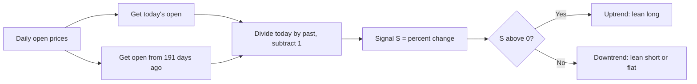

# OPEN_ROC — Long-Term Open-Price Momentum

> **Expression:** `ROC(open, n=191)`
> **Complexity:** 2 · **Out-of-sample Sharpe:** **+0.271**

## 1. The idea in plain English

Compare today's opening price with the opening price **191 trading days ago** (about 9 months). If price is higher, the trend is up; if lower, the trend is down. It is classic momentum.

## 2. Formula

$$
S_t=\operatorname{ROC}_{191}(\text{Open})_t=\frac{\text{Open}_t-\text{Open}_{t-191}}{\text{Open}_{t-191}}=\frac{\text{Open}_t}{\text{Open}_{t-191}}-1
$$

## 3. Algorithm diagram

## 4. Test results

| | Sharpe | Sortino | Max DD | Turnover | Mean pos | Bull | Bear |
|---|---|---|---|---|---|---|---|
| In-sample | +0.662 | +0.833 | 0.101 | 0.0557 | -0.028 | +0.70 | +0.96 |
| **Out-of-sample** | **+0.271** | n/a | n/a | n/a | n/a | n/a | n/a |

A sibling, `ROC(vwap, n=192)`, scored train +0.616 / OOS +0.263.

**Read:** the simplest strategy in the set. Its Sharpe falls by more than half out-of-sample (0.66 to 0.27), and turnover is the highest of the frontier rows shown, so treat it as a weak baseline rather than a standalone edge.

## 5. Assumptions

ROC as fractional change; position mapping, costs and annualisation handled by the engine.
