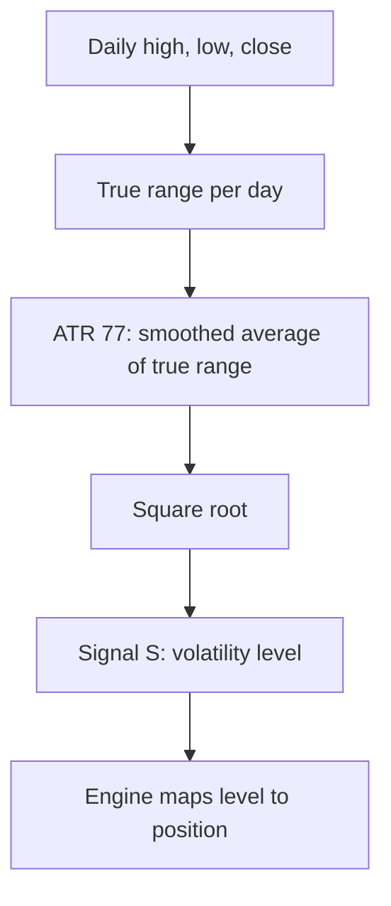

# SQRT_ATR — Square Root of Average True Range

> **Expression:** `SQRT(ATR(n=77))`
> **Complexity:** 2 · **Out-of-sample Sharpe:** **+0.378**

## 1. The idea in plain English

Measure how much the price typically moves in a day over the last 77 days (Average True Range), then take the square root to compress big values. This is a **volatility-level** signal, not a direction signal: it says "how turbulent is the market", and the engine maps that level to a position.

## 2. Formula

**True range**

$$
TR_t=\max\Big(H_t-L_t,\ \lvert H_t-C_{t-1}\rvert,\ \lvert L_t-C_{t-1}\rvert\Big)
$$

**Average True Range** ($n=77$, Wilder smoothing)

$$
\operatorname{ATR}_{77}(t)=\frac{76\cdot\operatorname{ATR}_{77}(t-1)+TR_t}{77}
$$

**Signal**

$$
S_t=\sqrt{\operatorname{ATR}_{77}(t)}
$$

## 3. Algorithm diagram

## 4. Test results

| | Out-of-sample Sharpe | Complexity |
|---|---|---|
| **Out-of-sample** | **+0.378** | 2 |

Only the OOS Sharpe was in the log.

**Read:** any edge here comes from a relationship between the volatility level and returns in the sample (for example higher volatility being followed by higher returns), not from a price-direction view. Such relationships can be regime-dependent, so verify before relying on it.

## 5. Assumptions

Wilder-smoothed ATR in price units; square root is monotonic, so it changes scale but not the ordering of signal values.
