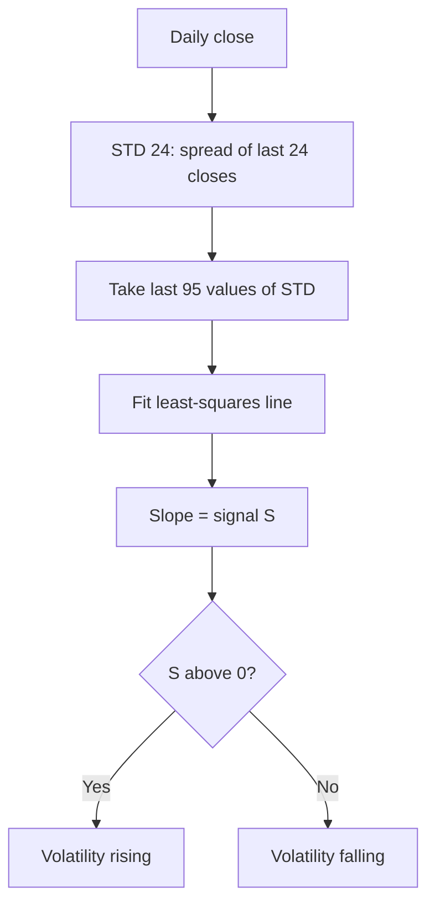

# STD_SLOPE — Trend of Volatility

> **Expression:** `ROLL_SLOPE(STD(close, n=24), n=95)`
> **Complexity:** 3 · **Out-of-sample Sharpe:** **-0.071** (does not work)

## 1. The idea in plain English

1. Measure the **24-day standard deviation** of the close, i.e. how spread out prices have been.
2. Fit a line through the **last 95 days** of that measure.
3. The slope says whether volatility is **rising** (positive) or **falling** (negative).

## 2. Formula

**Rolling standard deviation** ($n=24$)

$$
V_t=\sqrt{\frac{1}{23}\sum_{i=0}^{23}\left(C_{t-i}-\bar C_t\right)^2},\qquad \bar C_t=\frac{1}{24}\sum_{i=0}^{23}C_{t-i}
$$

**Rolling regression slope** ($m=95$)

$$
S_t=\frac{\sum_{i=0}^{94}\left(i-47\right)\left(V_{t-94+i}-\bar V\right)}{\sum_{i=0}^{94}\left(i-47\right)^2}
$$

## 3. Algorithm diagram

## 4. Test results

| | Out-of-sample Sharpe | Complexity |
|---|---|---|
| **Out-of-sample** | **-0.071** | 3 |

**Read:** negative out-of-sample Sharpe, so this candidate has no demonstrated edge. It is most likely a member of the search frontier because of its low complexity or other secondary criteria, not because it earns money. Not recommended.

## 5. Assumptions

Sample standard deviation (divisor $n-1$); slope by ordinary least squares against a time index. Note that $V_t$ on raw close prices scales with the price level, so the slope also picks up long-run price trends.
