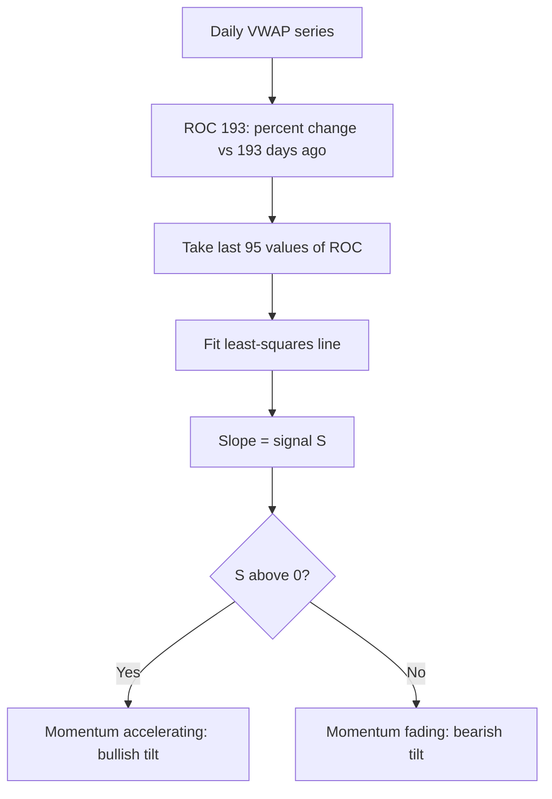

# VWAP_ROC_SLOPE — Trend of Momentum

> **Expression:** `ROLL_SLOPE(ROC(vwap, n=193), n=95)`
> **Complexity:** 3 · **Out-of-sample Sharpe:** **+0.566**

## 1. The idea in plain English

1. Compute the **193-day percentage change** of the VWAP (volume-weighted average price), i.e. long-term momentum.
2. Fit a straight line through the **last 95 days** of that momentum.
3. The **slope** of that line is the signal: positive means momentum is *accelerating*, negative means it is *fading*.

It is a "momentum of momentum" (second-order trend) indicator.

## 2. Formula

**Step 1 – Rate of change**

$$
R_t=\operatorname{ROC}_{193}(\text{VWAP})_t=\frac{\text{VWAP}_t}{\text{VWAP}_{t-193}}-1
$$

**Step 2 – Rolling regression slope** ($m=95$)

$$
S_t=\frac{\sum_{i=0}^{94}\left(i-\bar\imath\right)\left(R_{t-94+i}-\bar R\right)}{\sum_{i=0}^{94}\left(i-\bar\imath\right)^2},\qquad \bar\imath=47
$$

where $\bar R$ is the average of $R$ over the 95-day window.

**Combined**

$$
S_t=\operatorname{ROLL\_SLOPE}_{95}\!\Big(\operatorname{ROC}_{193}(\text{VWAP})\Big)_t
$$

## 3. Algorithm diagram

## 4. Test results

| | Sharpe | Sortino | Max DD | Turnover | Mean pos | Bull | Bear |
|---|---|---|---|---|---|---|---|
| In-sample | +0.843 | +1.080 | 0.087 | 0.0160 | -0.002 | +0.94 | +1.13 |
| **Out-of-sample** | **+0.566** | n/a | n/a | n/a | n/a | n/a | n/a |

A sibling on the frontier, `ROLL_SLOPE(ROC(high, n=193), n=97)`, scored train +0.836 / OOS +0.602, so the idea holds across nearby price inputs.

**Read:** solid and simple (complexity 3), very low turnover, positive in both bull and bear training regimes, with a moderate drop from in-sample to out-of-sample. Full cost/bootstrap tests were not in the log.

## 5. Assumptions

- `vwap` on daily data is taken as the bar's volume-weighted price; if only OHLC is available, engines typically use $(H+L+C)/3$.
- ROC is the fractional change (multiplying by 100 does not change the slope's sign).
- Position mapping and Sharpe annualisation are handled by the backtest engine.
