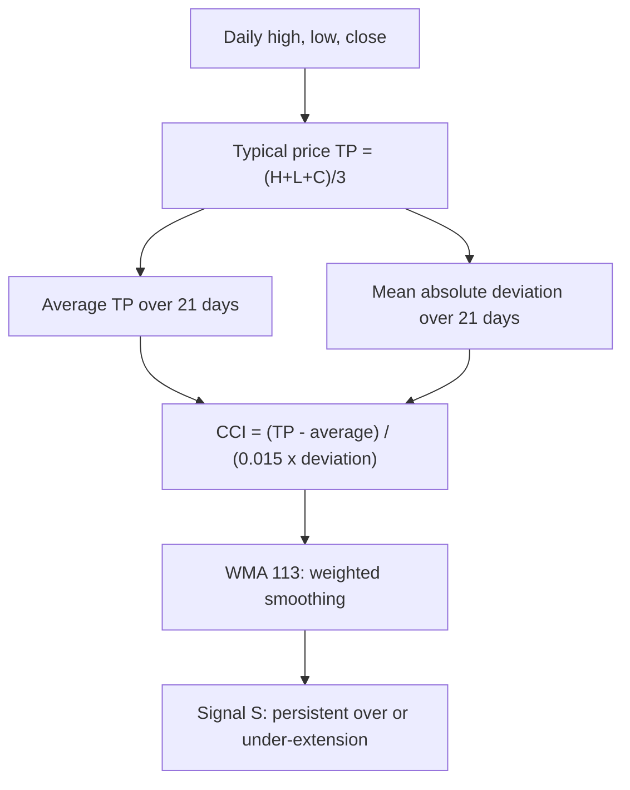

# WMA_CCI — Smoothed Commodity Channel Index

> **Expression:** `WMA(CCI(n=21), n=113)`
> **Complexity:** 2 · **Out-of-sample Sharpe:** **+0.198**

## 1. The idea in plain English

The CCI tells you how far today's typical price is from its 21-day average, measured in units of typical wobble. It is jumpy, so it is then averaged over 113 days (recent days weighted more). The result is a slow "is price persistently above or below its short-term norm" score.

## 2. Formula

**Typical price**

$$
TP_t=\frac{H_t+L_t+C_t}{3}
$$

**CCI** ($n=21$)

$$
\operatorname{CCI}_t=\frac{TP_t-\operatorname{SMA}_{21}(TP)_t}{0.015\cdot \operatorname{MD}_{21}(t)},\qquad
\operatorname{MD}_{21}(t)=\frac{1}{21}\sum_{i=0}^{20}\left\lvert TP_{t-i}-\operatorname{SMA}_{21}(TP)_t\right\rvert
$$

**Weighted moving average** ($n=113$)

$$
S_t=\operatorname{WMA}_{113}(\operatorname{CCI})_t=\frac{\sum_{i=0}^{112}(113-i)\,\operatorname{CCI}_{t-i}}{113\cdot114/2}
$$

## 3. Algorithm diagram

## 4. Test results

| | Out-of-sample Sharpe | Complexity |
|---|---|---|
| **Out-of-sample** | **+0.198** | 2 |

Only the OOS Sharpe was in the log.

**Read:** a weak edge. Heavy smoothing (113 days) keeps turnover low but also makes the signal slow.

## 5. Assumptions

Standard CCI with constant 0.015 and mean absolute deviation; WMA with linearly decreasing weights.
